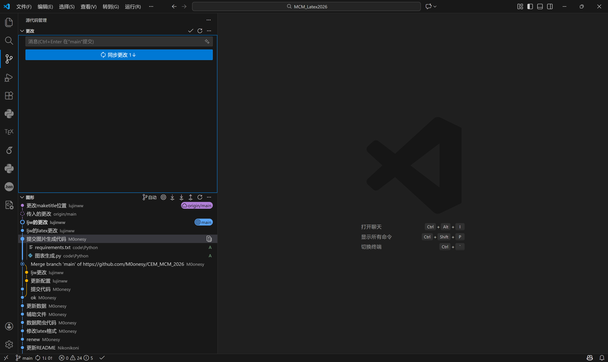
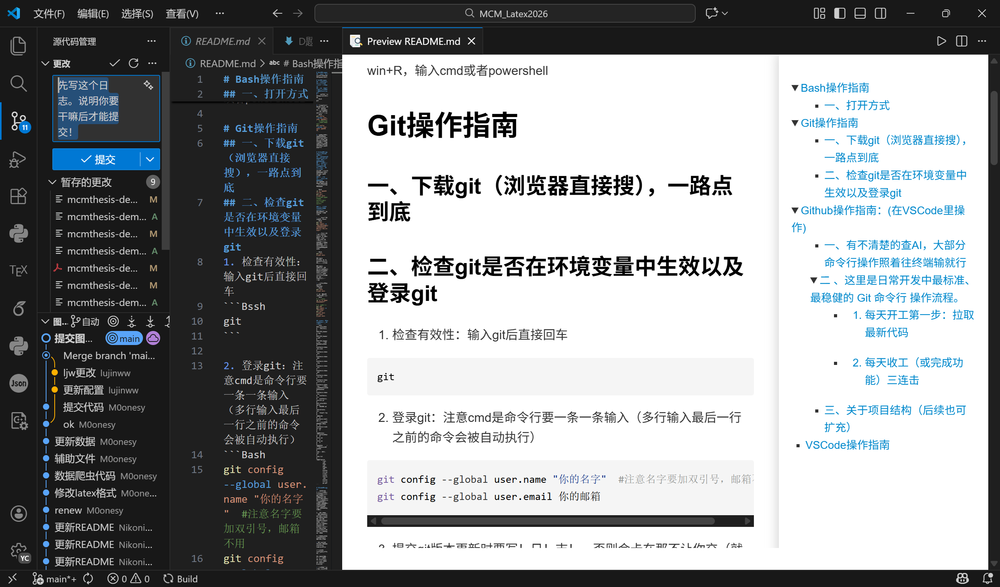
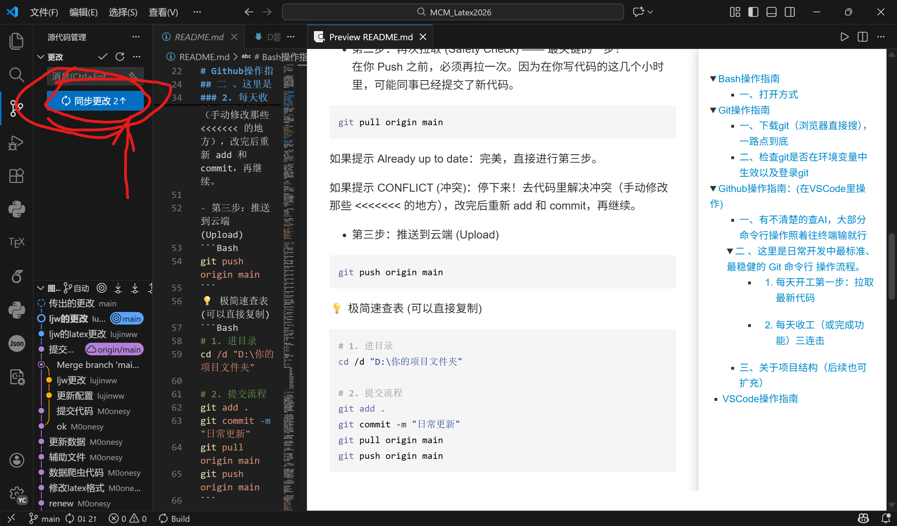
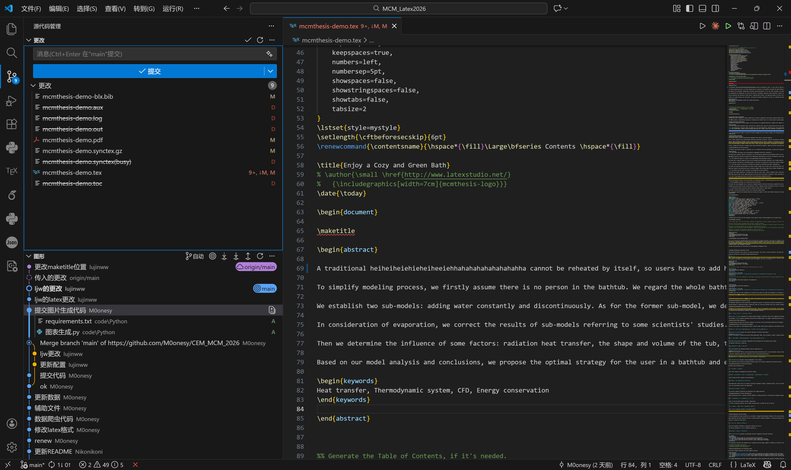
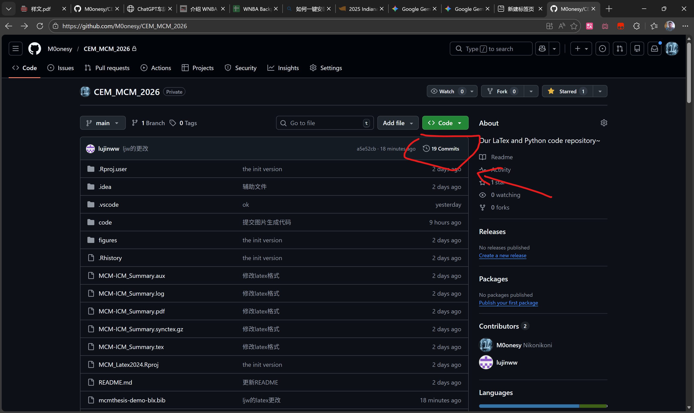
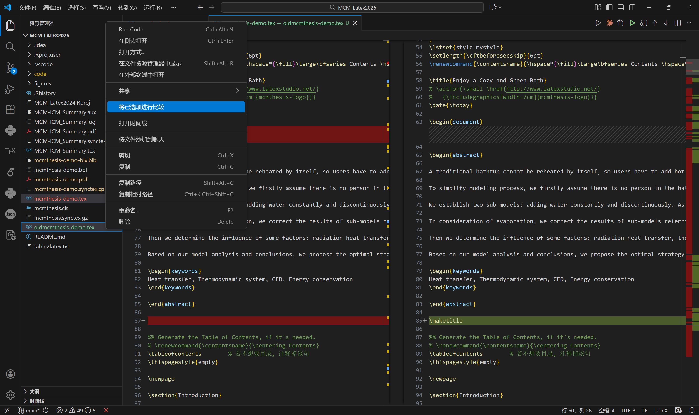

# VSCode操作指南简介

1. VScode本质是个编辑器（记事本），靠插件驱动顺着系统path路径（在设置-高级设置-环境变量里）找到的编译器.exe及相关环境来实现各种程序代码的编译compile、运行run和调试debug等功能
  
2. 和交流的语言一样，代码要有对应的“环境”才能被正确读取与运行。注意VSCode里右下角倒数第三个图标的环境是否正确（特别注意python中虚拟环境是否选择正确），然后注意编码格式不要乱码什么的

3. 注意代码文件命名要清晰易懂，写注释。

4. **插件与json设置配置（重要）**
- 先导入我的VSCode配置文件ychconfig.code-profile
(省去手写config的痛苦步骤...
点击左下角齿轮 ⚙️ -> 配置文件 (Profiles) -> 导入配置文件 (Import Profile)


# Bash操作指南
## 一、打开方式
win+R，输入cmd或者powershell

# Git及Github操作指南
- 有不清楚的查AI，大部分命令行操作照着往终端输就行
- 详细教程推荐这一篇：https://liaoxuefeng.com/books/git/introduction/index.html
## 一、下载git（浏览器直接搜），一路点到底
## 二、检查git是否在环境变量中生效以及登录git
1. 检查有效性：在Powershell输入git后直接回车
```Bssh
git
```

2. 登录git：注意cmd是命令行要一条一条输入（多行输入最后一行之前的命令会被自动执行）
```Bash
git config --global user.name "你的名字"  # 名字随便输都行，注意名字要加双引号，邮箱不用
git config --global user.email 你的邮箱   
```


## 三、初始化本地git仓库

1. 本地创建空文件夹（例如叫Reposit）
2. 用VScode打开该文件夹，在顶栏的终端选项里选择新建终端，此后在终端中操作
3. 本地仓库初始化，输入
```Bash
git init
```
4. 将云端的github项目仓库pull到本地git仓库，此步同时完成项目同步与建立关联，输入
```Bash
git remote add origin https://github.com/M0onesy/Mathor_2026.git  
#关联到咱的项目（git可能此时要求你登录github，注意查看浏览器确认授权，别卡在这里）
```
仓库地址：https://github.com/M0onesy/Mathor_2026.git


## 四 、标准 Git 命令行开发操作流程。
“开工前先拉取，完工后要提交”。
### 1. 每天开工第一步：拉取最新代码
防止你写了一天代码，最后发现和同事昨天改的冲突了。

```Bash
cd "你的项目路径" #确保选中工作目录
git pull origin main  #(注：如果远程分支叫 master，就把当前 main分支 改成 master)
```
注意要确认分支名称，保证当前在主分支上提交：
[创建与合并分支](https://liaoxuefeng.com/books/git/branch/create/index.html)
### 2. 每天收工提交流程
写完代码准备提交时的标准操作。

 提交git版本更新时要写！日！志！，否则会卡在那不让你交（就是蓝色那个提交按钮上面的消息框要有写的内容才能提交到git）


- 第一步：暂存与提交 (Save)
暂存当前完成的工作
```Bash
git add .
git commit -m "这里写清楚你今天干了啥（比如：修复了登录bug）"
```

- 第二步：再次拉取 (Safety Check) —— 最关键的一步！
在你 Push 之前，必须再拉一次。因为在你写代码的这几个小时里，可能同事已经提交了新代码。
```Bash
git pull origin main
```
如果提示 Already up to date：完美，直接进行第三步。

如果提示 CONFLICT (冲突)：去代码里解决冲突（手动修改那些 <<<<<<< 的地方）确认取舍哪个版本的代码，改完后重新 add 和 commit，再继续。

- 第三步：推送到云端 (Upload)
```Bash
git push origin main
```
💡 极简速查表 (可以直接复制)
```Bash
# 1. 进目录
cd /d "D:\你的项目文件夹"

# 2. 提交流程
git add .
git commit -m "日常更新"
git pull origin main
git push origin main
```

其他参考命令
```Bash
#一定不要直接执行 git push -u origin main！！！这会强制覆盖掉github上当前的所有文件，要先pull拉下来解决完冲突确认无误后再push上去完成更新。
git remote -v  #查看当前的github关联
git remote remove origin  #删除错误的关联
git pull origin main --allow-unrelated-histories  允许不相关的历史合并（git和github仓库都非空有文件且目前无关联时使用）
```


# Git_GUI操作指南
- commit、push等操作常用，比较方便快捷，是之前在终端命令行操作的可视化替代，但其他操作往往不太好用。

## 一、GUI界面
这个方法比较便捷直观但经常有各种不可名状的bug；
遇到难以解决的情况就用命令行吧，远程操作会稳定很多。
### 1.本地无修改，拉取远程修改

直接点同步更改就行

### 2.远程无修改，推送本地修改

先写日志保存到本地git

再点一次推送到远程仓库

### 3.本地远程都有修改，更新目前版本并推送本地修改

这张图展示了你们项目最新的 **Git 提交历史**，比上一张图多了一些关键的协作状态。简单来说，你现在的处境是：**有人跑在你前面了，你需要同步。**

以下是图中的关键点详解：

### 1. 团队出现了“分叉”

你会发现顶部出现了两条平行的线（紫色和蓝色）：

* **紫色点 (`origin/main`)**：这是 **GitHub 远程仓库** 的状态。队友 `lujinww` 已经把“更改maketitle位置”推送到了云端。
* **蓝色空心圆 (`main`)**：这是 **你本地** 的状态。你目前停留在“ljw的更改”这一步。
* **含义**：你的本地代码落后于远程仓库一个版本，且你们的修改路径分叉了。

---

### 2. 状态标签说明

* **`origin/main` (云朵图标)**：代表 GitHub 服务器上最新的代码位置。
* **`main` (目标图标)**：代表你当前电脑上代码所在的位置。
* **`传入的更改` (虚线圆圈)**：这是插件在提醒你，云端有新的 Commit，你还没拉取（Pull）下来。

---

### 3. 具体提交内容

图中展开了 `M0onesy` 的一次提交，显示了具体修改的文件：

* **`requirements.txt`**：增加了 Python 环境依赖列表。
* **`图表生成.py`**：新增了一个用于画图的脚本。
* **右侧绿色 "A"**：代表 **Added**，即这是新创建的文件。

---

### 4. 你现在该做什么？

由于 `origin/main` 领先于你的本地 `main` 分支，为了避免后续冲突，建议你按以下步骤操作：

1. **Stash (贮藏)**：如果你本地有还没写完的代码，先点 VS Code 里的“暂存”或“贮藏”。
2. **Pull (拉取)**：点击右上角的刷新或同步图标，执行 `git pull`。这会将紫色的“更改maketitle位置”合并到你的本地。
3. **解决冲突**：如果你们改了同一个文件的同一行，Git 会提示你选择保留谁的代码。

## 二、比较版本差异
### 1. 准备好两份要比较的文件

把从github上下载或者用本地的备份文件和现版本的文件放在同一文件夹，注意不要重名
### 2. ctrl双选，右键比较

**可以清晰地看到修改了哪些部分和修改类型**


## 三、关于项目结构（后续也可扩充）
```text
Reposit
│  .gitignore
│  example.aux
│  example.log
│  example.out
│  example.pdf
│  example.synctex.gz
│  example.tex
│  example.toc
│  main.tex
│  MathorCupmodeling.cls
│  README.md
│
├─figures
├─RDMfig
│      1111.png
│      2222.png
│      github版本查找.png
│      本地与远程都有修改.png
│      比较代码差异.png
│      直接pull.png
│
└─src
    ├─output
    └─pyCode
```

